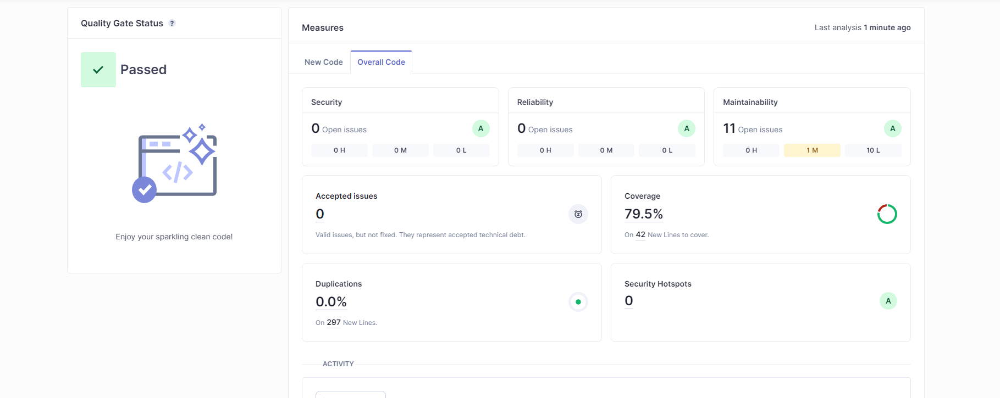

## Quality Gate

### Passou no quality gate com uma cover percentage de 79.5, nota A na maior parte dos parametros, o unico problema mais "grave" foi o facto de ter dado disabled num teste por ele nesta aula nao estar a passar e antes estar, para nao perder tempo de volta do teste marquei-o como disabled.

## Issues found

 |        Issue      |    Problem Description  | How to fix    |
 | ----------------- | ----------------------- | ------------- |
 | Either add an explanation about why this test is skipped or remove the "@Disabled" annotation | Como marquei um teste como Disabled adicionar uma explicacao | Adicionar um comentario sobre o porque do teste estar disabled
 

### Sem o jacoco plugin nao tinha percentagem de coverage nenhuma, apos adicionar o plugin do jacoco obtive coverage de 79.5%