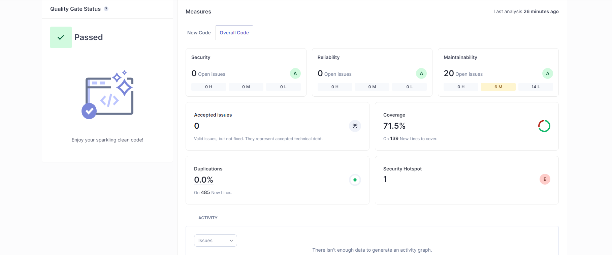

## Quality Gate

### Passou a quality gate com uma coverage percentage de 71.5, com nota A em reliability, nota A em security, E em security review, A em maintainnability, <3% em duplication, <1% em size 

## Issues found

 |        Issue      |    Problem Description  | How to fix    |
 | ----------------- | ----------------------- | ------------- |
 | Weak Cryptography | Make sure that using this pseudorandom number generator is safe here. | Use a cryptographically strong random number generator (RNG) like "java.security.SecureRandom" in place of this PRNG. 
 | Invoke method(s) only conditionally. | Some method calls can effectively be "no-ops", meaning that the invoked method does nothing | Refactor
 |Remove this unused method parameter "subset". | A typical code smell known as unused function parameters refers to parameters declared in a function but not used anywhere within the function’s body | Having unused function parameters in your code can lead to confusion and misunderstanding of a developer’s intention
 

